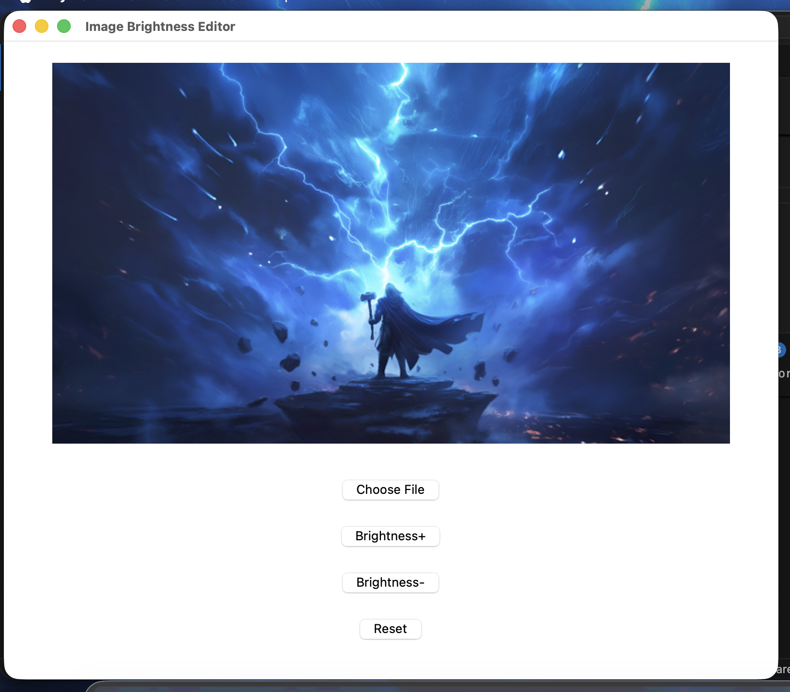

# Image Brightness Editor

A simple desktop application built with **Python**, **Tkinter**, and **OpenCV** that allows users to upload an image and adjust its brightness.

## Features

- Upload an image from your computer
- Increase image brightness
- Decrease image brightness
- Reset the image to its original state

## Technologies Used

- Python
- Tkinter
- OpenCV
- Pillow (PIL)

## Installation

1. Clone the repository:

```bash
git clone https://github.com/your-username/image-brightness-editor.git
```

2. Go to the project folder:

```bash
cd image-brightness-editor
```

3. Install the required packages:

```bash
pip install opencv-python pillow
```

4. Run the application:

```bash
python image-brightness-editor.py
```

## Project Structure

```
image-brightness-editor/
│── image-brightness-editor.py
│── wallpaper.jpg
│── README.md
```

## Screenshot

